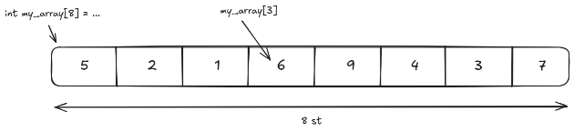

# Array

En __array__ är, liksom variabler, ett sätt att hålla information, _mutera_ (ändra) information och hämta information. Skillnaden mellan __arrays__ och variabler är att __arrays__ håller flera element (tänk dig variabler) som ligger efter varandra i minnet.

En __array__ är egentligen en pointer till första elementet samt antalet element. Dessutom behöver vi en typ av element för att få reda på storleken för varje element.

En __array__ kan inte bli större på grund av det faktum att det bara är ett sammanhängande bit minne. Vi riskerar att skriva över annan data i vårt program om vi försöker göra den större. Därför behöver vi säga till C++ hur många element vi vill ha i programmet samt vilken typ som elementen har. Olika typer har olika storlekar.

```cc
int my_array[3] = {5, 2, 1}; // initialiserar [5, 2, 1]
```

För att få tag i ett element “indexerar” vi in i vår __array__. Vi läser en plats i __arrayen__ utifrån dess position. För att utföra detta gör vi något som kallas “ __pointer arithmetic__ ”, även kallat “matte med pointers”. I vanliga fall är __pointer arithmetic__ farligt på grund av att du kan råka gå utanför det minne som du hade tänkt. Detta är även fallet här så man måste vara noga med att hålla sig till antalet element man angett.

Vi börjar på platsen för första elementet och sedan adderar antalet element multiplicerat med storleken på våra element. Om vi skulle räkna ut vilken pointer vi behöver ha för att nå element 2, $y$, av en `int my_array[3]` där $x$ är vår pointer:

$$
s = \text{storleken på en int}\\
y = x + 2 \cdot s
$$

__Note__: Det är av den anledningen som första elementet har index 0.

C++ har en syntax för att göra detta automatiskt, så man behöver inte tänka i dessa banor medan man programmerar. Det är bara bra att veta vad som faktiskt händer. Syntaxen som vi har är `[x]` där `x` är vår index.



